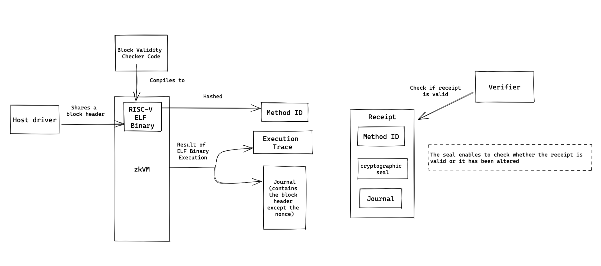

# Bitcoin Block Header ZK Proof

A simple program bitcoin block header proof, built on the RISC Zero platform.

This program is implemented is rust, and uses [RISC Zero’s zkVM](https://github.com/risc0/risc0). It can be used to convince someone that we are in possission of a valid Bitcoin Block Header, whithout revealing the nonce. One might use such a gadget to convince a mining pool to give you some money up front before delivering the header.

## Overview 

The program is composed of several parts: a block validity checker (that runs in the zkVM) and a host driver (an ordinary command-line program that uses the zkVM to run the Block Validity Checker).

The block validity checker accepts a bitcoin block header from the host driver. It then uses a function that examines the validity of the block  and panics if the block is not valid. If the block is valid, execution proceeds and the zkVM appends the constituents of the block header (except for the nonce) to the journal. 

The journal is a readable record of all values committed by code in the zkVM; it is attached to the receipt (a record of correct execution). The receipt can be used by a verifier to identify which binary was executed (via the method ID), check the shared results with this particular execution (via the journal), and verify its own integrity (via the cryptographic seal).

## Run this example

To build and run this example, use:

cargo run --release

## TODO
- Add a cli package for the prover
- Add unit tests for the different packages
- Add Integration and e2e tests
- Add CI/CD